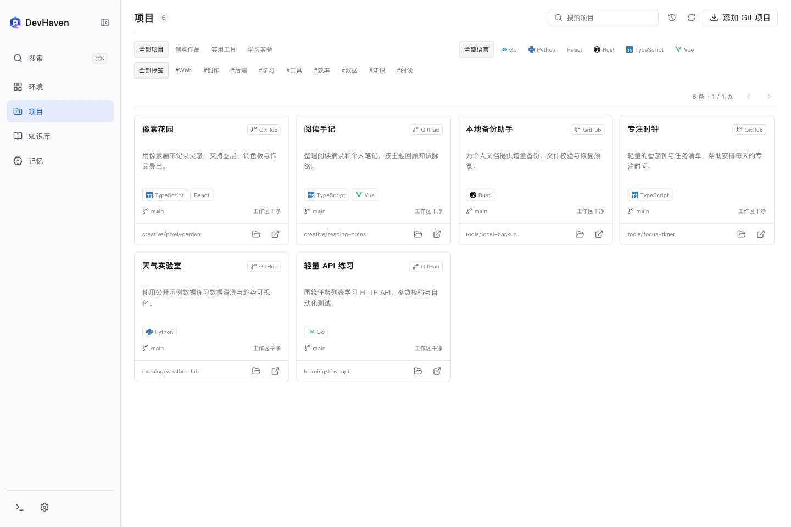
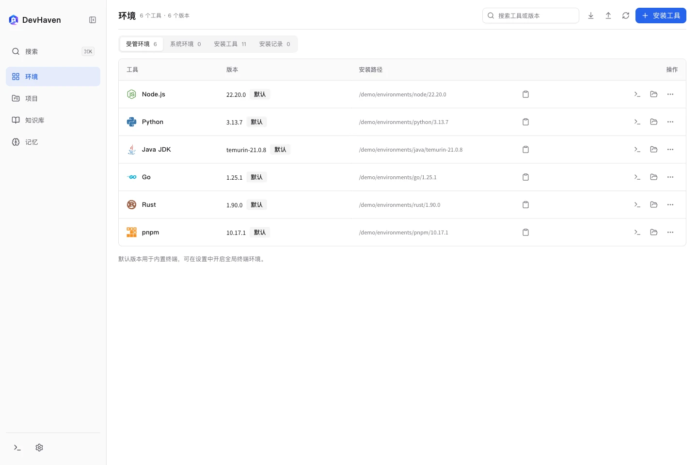
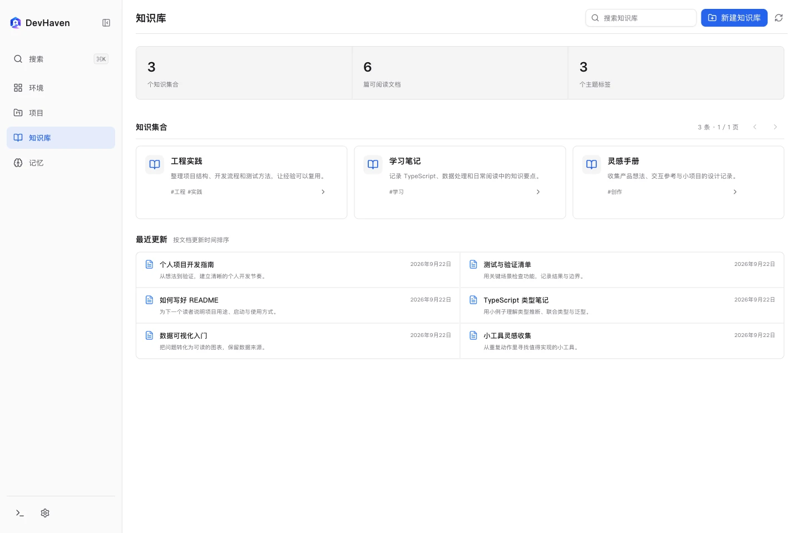
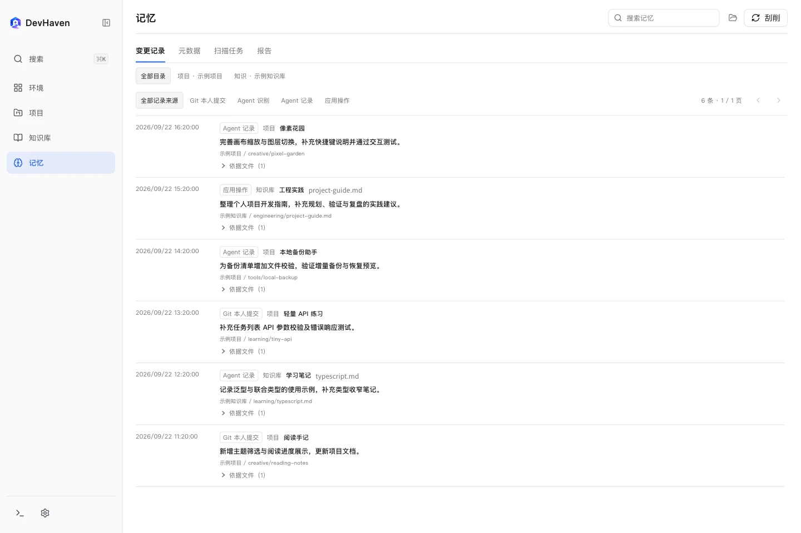
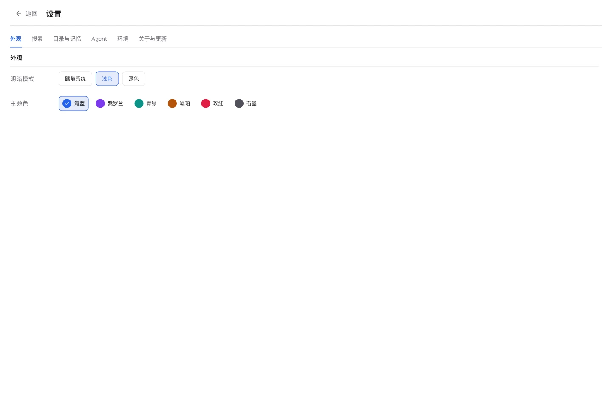
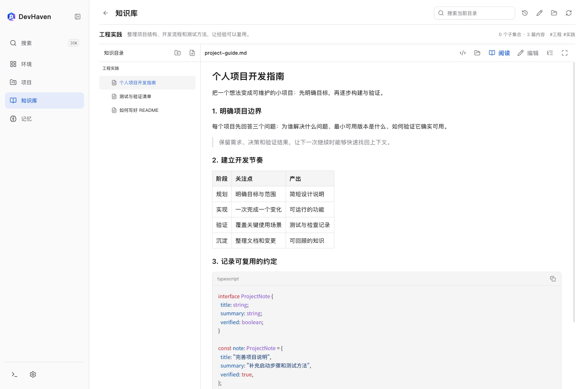
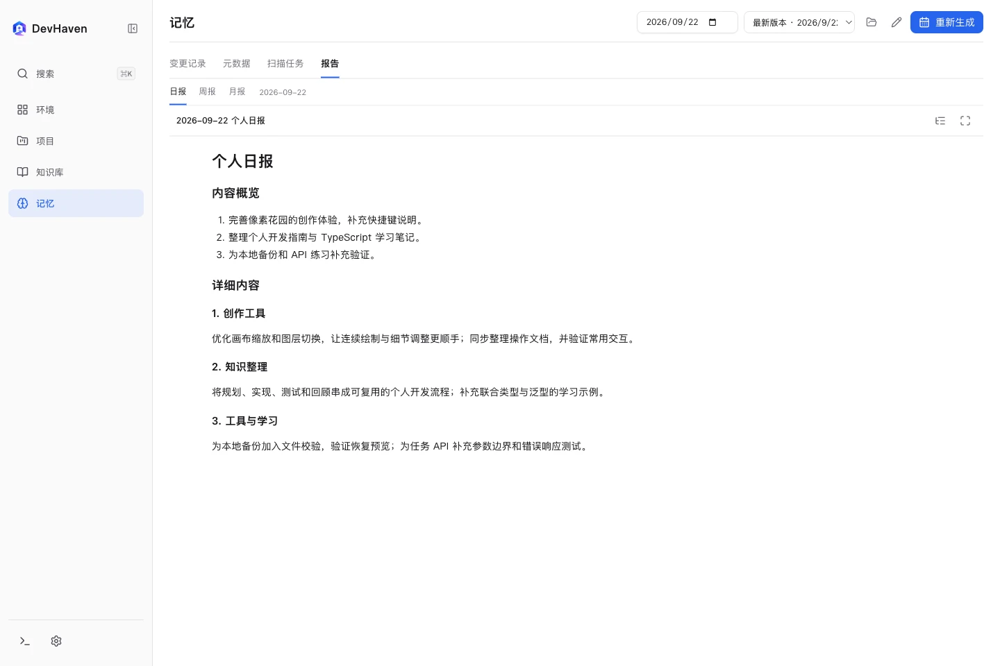
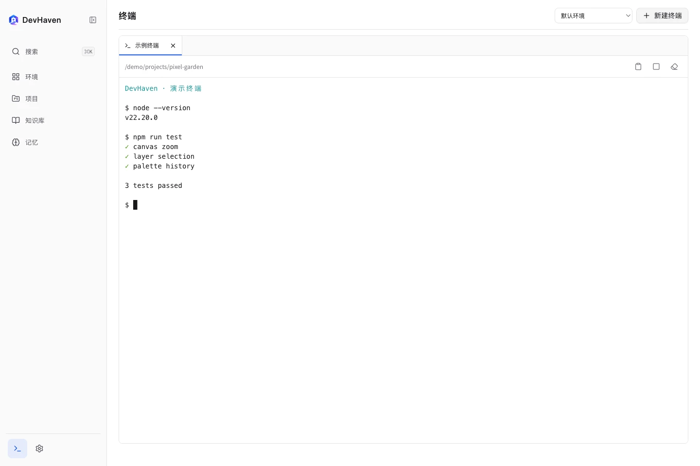
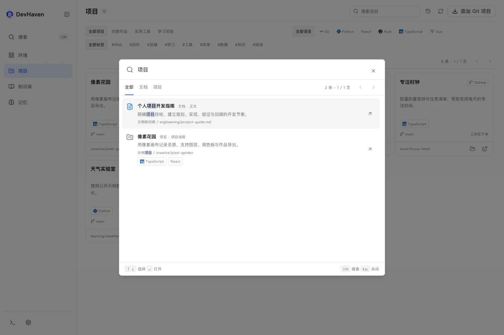

<p align="center">
  
</p>
<h1 align="center">DevHaven</h1>
<p align="center"><strong>面向 Vibe Coding 的本地开发管家</strong></p>
<p align="center">项目、环境、知识与个人记忆，让人和 Code Agent 都能找到上下文。</p>

<p align="center">
  <a href="https://github.com/shuangbofu/dev-haven/releases"></a>
  <a href="https://github.com/shuangbofu/dev-haven/actions/workflows/ci.yml"></a>
  <a href="LICENSE"></a>
  <a href="https://github.com/shuangbofu/dev-haven/releases"></a>
</p>
<p align="center">
  
  
  
  
</p>
<p align="center">
  <a href="https://github.com/shuangbofu/dev-haven/releases">下载 Beta</a> ·
  <a href="skills/devhaven-metadata/SKILL.md">Agent Skill</a> ·
  <a href="CONTRIBUTING.md">参与开发</a> ·
  <a href="SECURITY.md">数据与安全</a>
</p>

## 为什么做 DevHaven

有了 AI，开始一个项目、尝试一种技术、实现一个想法都变得更容易。项目越来越多，各自依赖的环境和版本也越来越多；持续沉浸在 Vibe Coding 中，很容易忘记本地有哪些项目、各自解决什么问题，以及前几天到底改过什么。

代码可以交给 Agent 协助实现，项目的用途、文档、决策和开发细节仍需要有人关注。它们如果只留在一次对话里，或者散落在不同目录中，下次继续时就要重新找路径、读文件、解释背景。

DevHaven 通过初始化刮削认识已有项目和知识库，再在日常开发中通过 Skill 更新元数据、记录真实改动。随时能回答“我有哪些项目”“资料在哪里”“最近做了什么”，也让下一次 Agent 接手时有据可查。平台负责本地管理，理解内容、编写代码和归纳报告可以交给外部编码智能体。

## 界面预览

以下截图来自真实界面，使用虚构的项目、文档、变更记录和路径作为演示数据，不包含个人或公司资料。点击图片可查看大图。

**项目：集中查看项目用途、技术栈和 Git 状态。**



| 环境：管理工具与默认版本 | 知识库：按用途组织知识集合 |
| --- | --- |
|  |  |
| **记忆：回顾项目与文档变更** | **设置：分类配置与主题外观** |
|  |  |

<details>
<summary>查看更多：文档阅读、个人报告、终端与全局搜索</summary>

| 文档阅读：目录树、排版与代码高亮 | 个人报告：概览与详细内容 |
| --- | --- |
|  |  |
| **终端：在受管环境中使用命令行** | **全局搜索：查找文档正文与项目内容** |
|  |  |

</details>

## 安装与首次使用

当前版本为 **0.1.0-beta.1**，是早期预发布版本。界面、元数据格式和接口仍可能调整，建议先用少量目录体验，并备份个人记忆和报告。

首版提供 **macOS Apple Silicon（arm64）** 的 DMG 和 ZIP。Windows、Linux 与 Intel Mac 可从源码构建，尚不提供本版本安装包或桌面实机验收承诺。

1. 在 [Releases](https://github.com/shuangbofu/dev-haven/releases) 下载对应文件，将 `DevHaven.app` 放入 Applications。
2. 首次打开，选择项目目录、知识库目录、记忆目录和报告目录。项目和知识库均可配置多个根目录。
3. 需要刮削或生成报告时，先安装并登录本地 Codex CLI，在设置的 Agent 标签中选择可执行文件及模型。
4. 开始刮削，让 Agent 根据真实文件登记项目和知识集合；在设置中配置本人 Git 提交邮箱。
5. 将 [devhaven-metadata Skill](skills/devhaven-metadata/SKILL.md) 安装到编码智能体，在日常开发中查询资料、维护元数据并提交改动记录。

桌面客户端自带运行时。外部 Skill 客户端需要 Node.js 22+；Git 操作需要本机 Git，VS Code 打开入口需要已安装并注册其 URL 协议。

macOS 安装包采用 ad-hoc 签名，**未经过 Apple 公证**。系统可能阻止首次打开；确认下载来源和校验和后，可按 macOS「隐私与安全性」中的提示允许该应用。不要关闭系统整体安全保护。下载文件的 SHA-256 可与 Release 的 `SHA256SUMS.txt` 核对。

## 能做什么

### 项目

- 用卡片展示已登记项目的名称、用途、语言／技术和 Git 状态，支持分组、语言及标签筛选。
- 点击进入项目详情，阅读 README、查看元数据、本人 Git 提交和集中变更记录。
- 快速用 VS Code 打开代码、定位本地目录、访问 GitHub 或企业 Git 仓库。
- 输入 Git 地址并从已配置根目录中选择目标文件夹，克隆并登记项目；已有目录不会被覆盖。
- 「更新代码」执行 `git pull --ff-only --no-rebase --no-autostash`，不自动提交、变基或丢弃改动。

私有仓库使用本机 Git credential helper 或 SSH agent，平台元数据不保存密码或令牌。启动配置可记录命令、参数和预览地址；当前版本**尚未提供进程启动／停止托管**。

### 知识库

知识库是带有名称、描述等元数据的知识集合。普通文件夹不会自动成为知识库。支持新建知识库、子集合及文档；新建位置限制在配置的根目录内。

进入集合后，通过目录树阅读和编辑内容：Markdown 支持章节目录、代码高亮、Mermaid 图表和全屏阅读；HTML 使用隔离阅读器，禁用脚本、表单及外部资源。JSON、CSS、JS/TS、Java、Go、Rust、Python 等文件支持源码高亮与编辑，内容不会执行。文档可直接用 VS Code 打开。

文档修改使用版本校验，避免覆盖外部编辑器已保存的更改，并将变更写入集中记忆。单文件阅读上限 2 MB，较大源码以纯文本回退，避免高亮阻塞。

### 搜索与导航

默认使用 `⌘K`（macOS）或 `Ctrl+K` 打开快捷搜索，可在「设置 → 搜索」修改窗口内快捷键。搜索跨所有配置来源，覆盖文档正文、项目 README、名称、描述、标签和路径。

结果支持预览和直接进入详情；文档可进入所属知识库，继续查看同集合的其他内容，项目可进入完整项目页。方向键选择结果，回车打开，Command/Ctrl+回车直接进入详情。

搜索使用本地持久索引，启动、应用内修改及每分钟后台刷新；设置中可重建索引。筛选项默认展示一行，超出部分通过「展开全部／收起」查看。侧栏支持折叠及调整宽度；设置是独立页面，按分类导航，并可返回之前页面。

### 环境

基于 mise 管理 Node.js、Python、Java JDK、Go、Rust、Maven、Gradle、Yarn、pnpm、uv、Electron 等工具，支持多版本安装、默认版本切换、卸载、系统环境检测及环境清单导入／导出。

内置终端支持多会话和语言交互入口。可选择开启全局终端集成：macOS/Linux 配置当前用户的 zsh、bash 或 fish；Windows 使用当前用户环境变量和 mise shims。配置前备份，关闭时移除平台写入的内容。已有外部终端需重新打开才能读取新环境。

首次安装先准备管理引擎。Yarn、pnpm 和 Electron 需要 Node.js；Maven、Gradle 需要 Java。工具历史版本是否可用取决于上游平台和架构支持。

### 集中记忆与个人报告

元数据、变更记录、扫描任务和图标保存在指定记忆目录，默认是用户主目录下的 `.devHaven/memory`。项目和文档目录保存实际内容，报告有独立目录。记录按所属项目／集合聚合，不向来源目录追加平台记账文件。

变更来源区分 Git、Agent 和应用操作。Git 只收集设置中本人邮箱对应的作者提交，保留实际作者时间；留空时使用各仓库的 Git 配置。扫描建立已有内容的基线，不把历史文件或他人提交当成今天的成果。

个人报告包含日报、周报和月报，使用「内容概览」编号总结及对应「详细内容」格式，每条明细引用真实变更。支持重新生成、编辑和历史版本。无记录时不调用 Agent。

## 与编码智能体协作

[Skill](skills/devhaven-metadata/SKILL.md) 说明何时查询、记录以及如何维护元数据。个人路径和知识库含义来自运行时上下文，不写死在 Skill 内。

典型流程：

1. 查找项目或资料前，查询平台上下文，了解注册目录、用途和已有元数据。
2. 创建或克隆项目后，阅读真实内容并登记项目及技术栈。
3. 完成并验证修改后，提交集中变更记录；用途、Git 信息或启动约定变化时同步元数据。
4. 检查回执，确认记录已被平台接收。应用关闭时投递保留在队列，重新打开后处理。

“自动记录”依赖 Agent 遵循 Skill，不是监听每次文件保存、Git hook 或拦截工具调用。应用内文档保存和 Git 操作已有记录，不需要重复提交。

外部客户端提供 `context`、`search`、`search-status`、`mcp`、`record` 和 `icon`。stdio MCP 提供上下文与搜索工具，复用本地索引；不监听网络端口。环境安装、扫描／报告触发、Git 操作目前由应用界面提供，外部客户端尚未开放这些命令。

- [元数据与记录格式](skills/devhaven-metadata/references/format.md)
- [搜索与 MCP 接入](skills/devhaven-metadata/references/search.md)
- [环境能力边界](skills/devhaven-metadata/references/environment.md)
- [本地图标规范](skills/devhaven-metadata/references/icons.md)
- [个人报告格式](skills/devhaven-metadata/references/reports.md)

## 数据与网络

搜索、元数据和记录保存在本地。**启用 Codex 扫描或报告会把选定样本交给用户配置的 Codex CLI，其模型服务和网络行为由该工具决定**；本地存储不意味着所有处理都留在设备。Git、工具下载、技术图标查询和应用更新也会访问网络。

记忆、索引、报告和诊断日志可能包含正文、源码、路径或内部信息。分享前应脱敏，不应提交到公共仓库。完整边界见 [SECURITY.md](SECURITY.md)。

## 外观与更新

提供六种主题色及浅色、深色、跟随系统。应用更新固定检查 [本仓库 Releases](https://github.com/shuangbofu/dev-haven/releases)，只提示并打开下载页，不自动安装或退出。Beta 客户端会检查公开预发布及稳定版本，稳定客户端仅检查稳定版本。

## 从源码运行与构建

使用 Electron、Next.js、React、TypeScript、Tailwind CSS 和 mise。需要 Node.js 22+、npm；原生终端模块须在目标操作系统及架构上安装依赖。

```sh
git clone git@github.com:shuangbofu/dev-haven.git
cd dev-haven
npm ci
npm run dev:desktop
```

```sh
npm test
npm run build
npm run release:source
npm run dist:mac
```

`release:source` 在 `release/source/` 生成白名单源码并检查个人路径和常见凭据，不上传文件。`dist:mac` 生成 Apple Silicon 的 DMG/ZIP；其他目标在对应主机执行 `npm run dist`。详见 [macOS 构建](MACOS-BUILD.md) 和 [贡献指南](CONTRIBUTING.md)。

推送与清单版本一致的 `v*` 标签会触发发布工作流，在原生 macOS arm64 runner 上构建、测试和检查，再附加 DMG、ZIP 及 SHA-256 清单到预发布。普通 CI 覆盖 macOS、Windows、Linux 的构建和单元测试，不等同于各平台桌面实机验收。

## 许可与品牌

源码采用 [MIT](LICENSE) 许可。安装包附带第三方依赖许可说明。DevHaven 品牌主图位于 `public/logo.png`；Java 图标来自 Devicon，Maven 图标来自 Apache Maven，其他内置技术图标来自 Simple Icons。品牌标志属于各自权利人。中文字体 Noto Sans SC 使用 SIL Open Font License。
